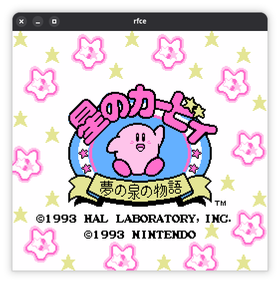

# rfce

rfce is a Famicom / NES emulator written in rust.



## Requirements

[SDL3](libsdl.org) is required to run rfce. SDL3 is available through various package managers, such as:

```sh
# debian-based linux system
~ $ sudo apt install libsdl3

# fedora-based linux system
~ $ sudo dnf install sdl3

# arch-based linux system
~ $ sudo pacman -S sdl3

# macOS system
~ $ brew install sdl3
```

On systems where a SDL3 package is not available (or you simply want to compile SDL3 manually), either the `build-sdl3` or `build-sdl3-static` (for dynamic/static linking respectively) feature can be enabled (both require `cmake`.)

## Building

```sh
# Build normally
~ $ cargo build --release

# With the `build-sdl3` feature
~ $ cargo build --release -F build-sdl3
```

## Running

```sh
# Run normally
~ $ rfce

# Optionally specify a file to load and start running
~ $ rfce <file.nes>

# Run without a GUI (starts a debugger)
~ $ rfce --headless <file.nes>
```

## Emulator status

### Mapper support

rfce has support for the following mappers:

- NROM
- MMC1
- MMC3

These mappers (especially MMC1 and MMC3) account for a large number of first-party games.

(Note that not all games utilizing these mappers have been tested (both MMC1 and MMC3 are used in 300+ cartridges (incl. different regions, revisions, etc.)), so your mileage may vary.)

### Missing features of note

The following is an incomplete list of features that are not (yet) implemented.

- Audio
- Famicom Disk System emulation
- Any and all other mappers
- PAL game support (games _may_ still run, but are likely going to be faster than normal due to running at ~60hz vs. ~50hz)

## Useful sources

- The [Nesdev Wiki](https://www.nesdev.org/wiki/Nesdev_Wiki)
- The [Mesen emulator](https://www.github.com/SourMesen/Mesen2). It's extensive debugging capabilities are especially useful!